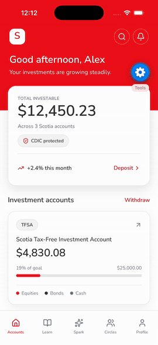

# Scotia Spark

> The moment Scotia notices your money is sitting still becomes the moment you start investing.

<p align="center">
  
</p>

<!-- Prefer a click-to-play video? Drag demo.mp4 into GitHub's README editor, or link it. -->

## About

Scotia Spark is a calm, trust-first investing app built into Scotiabank — designed to convert young Canadians (18–34) from depositors into investors, without the hype, streaks, or gamification that define fintech today.

It works because only Scotia can do it. Spark sees the chequing account, spots idle cash, projects what it could become in an FHSA, and offers a single tap to move it forward — backed by 190 years of trust, 950 branches, Scene+ rewards, and Scotia advisors a video call away.

**The hero moment:** *"You've kept $4,200 in chequing for 89 days. In a Scotia FHSA Essentials Portfolio, that could grow to roughly $5,300 in 5 years."*

Built for the **[case]Hacks 2026** Scotiabank case (May 23–24). All figures shown are fictional placeholder data for prototype purposes. Compliance is the feature, not the disclaimer.

## Design philosophy

It feels like Apple Wallet × Wealthsimple × Scotiabank — annual report, not video game.

- Serif headlines, muted earthy colors, one decision per screen.
- A bounded 5-card daily briefing that ends with *"You're caught up. Come back tomorrow."* — no infinite scroll, no dark patterns.
- Every reward is for **learning and consistency**, never trading or returns. The *"What we don't reward"* card stays permanently visible on the Profile tab as a trust flex.

## Trust & compliance, by design

- **"Explain this →" audit trail** — every AI explanation shows the Scotia sources it used and what the AI deliberately did *not* do.
- **Idle cash detection** — flags money sitting in chequing and projects its potential FHSA growth, with one tap to act.
- **No hype mechanics** — no streaks, no trading rewards, no engagement bait.

## Features

- **Personalized dashboard** — total investable balance across Scotia accounts, monthly performance, and CDIC-protection status at a glance.
- **Goal tracking** — per-account progress toward savings targets (e.g. TFSA / FHSA goal completion).
- **Daily briefing (Spark)** — a bounded, curated feed with ETF spotlights, risk and time-horizon tags, and one clear action per card.
- **Learn** — bite-sized financial education woven into the daily habit.
- **Ask Scotia AI** — conversational help for researching investments, with a transparent source trail.

## Tech stack

- **React Native** (0.85) with **Expo** (SDK 56)
- **TypeScript**
- **React Navigation** — native stack + bottom tabs
- **Reanimated** & **Gesture Handler** for animations and interactions
- **react-native-svg**, **expo-linear-gradient**, **expo-haptics**
- **AsyncStorage** for local persistence
- **lucide-react-native** icons

## Running locally

```bash
git clone https://github.com/shahanb06/ScotiaSpark.git
cd ScotiaSpark
npm install
npm start        # then press w for web, or i / a for iOS / Android simulators
```

## Team

Built by [@shahanb06](https://github.com/shahanb06) and [@Fawad-Pathan](https://github.com/Fawad-Pathan).

## License

MIT — see [LICENSE](LICENSE).
